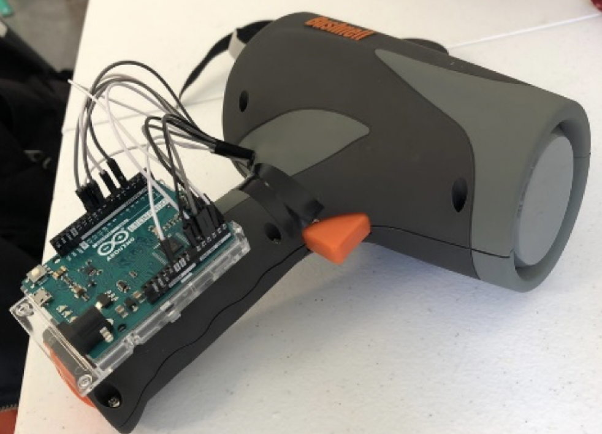
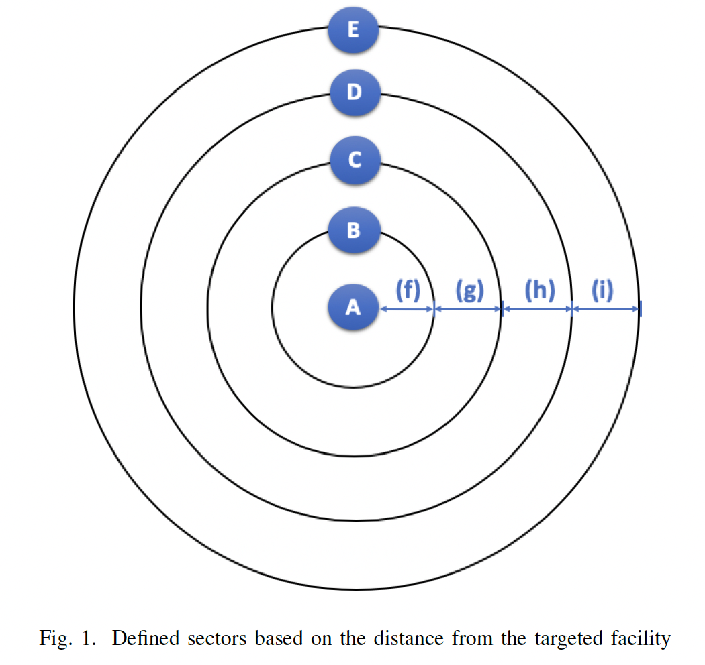
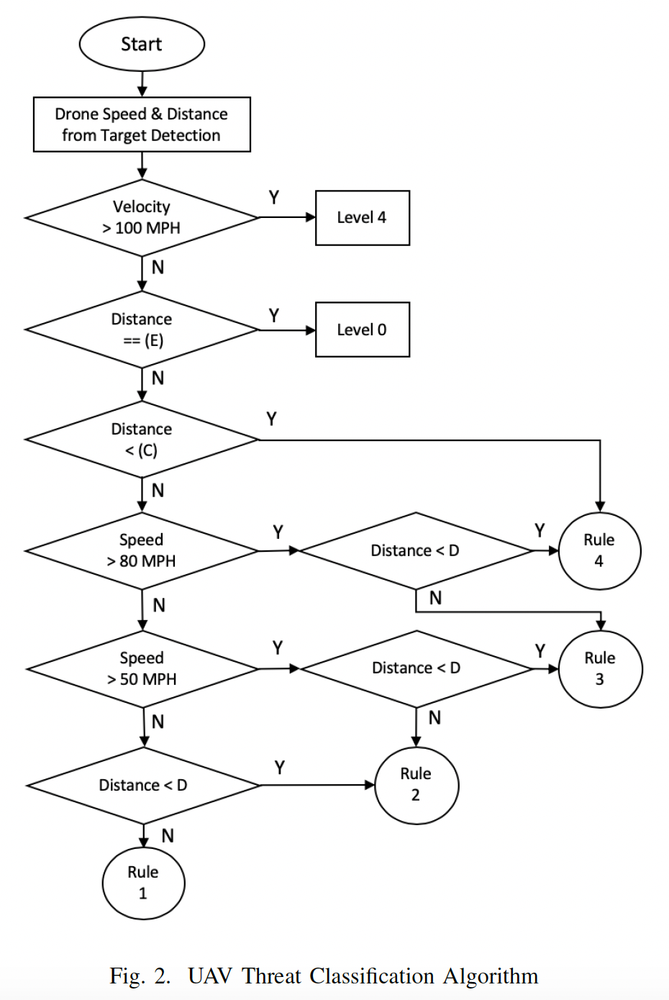
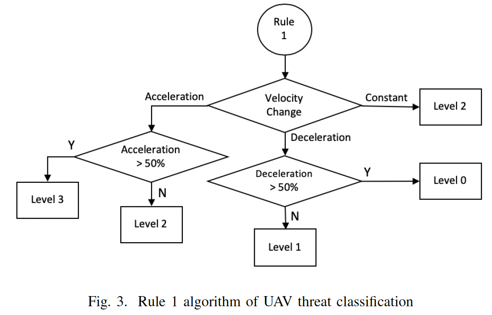
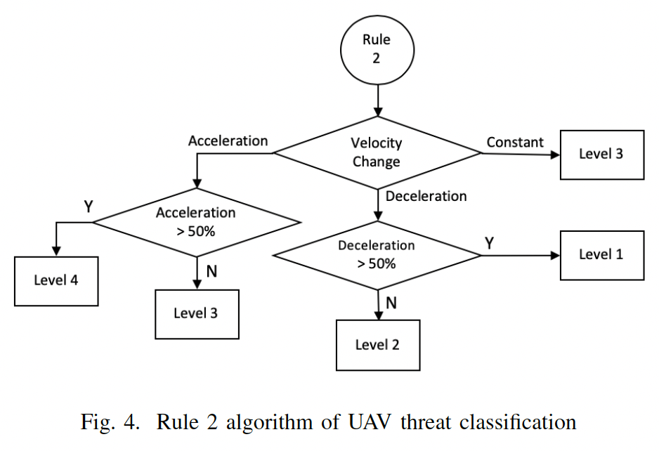
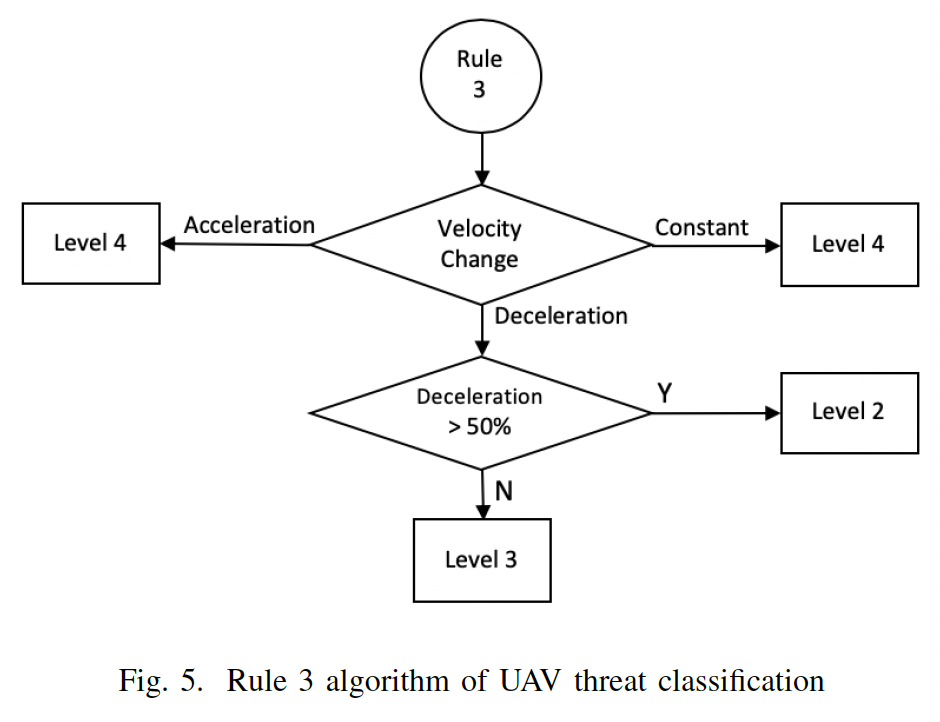
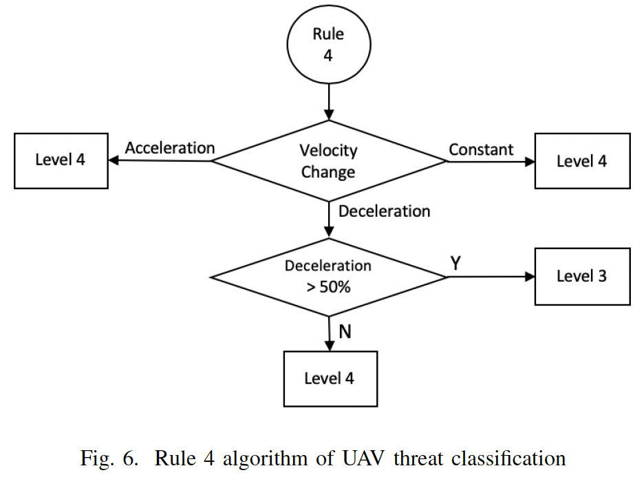
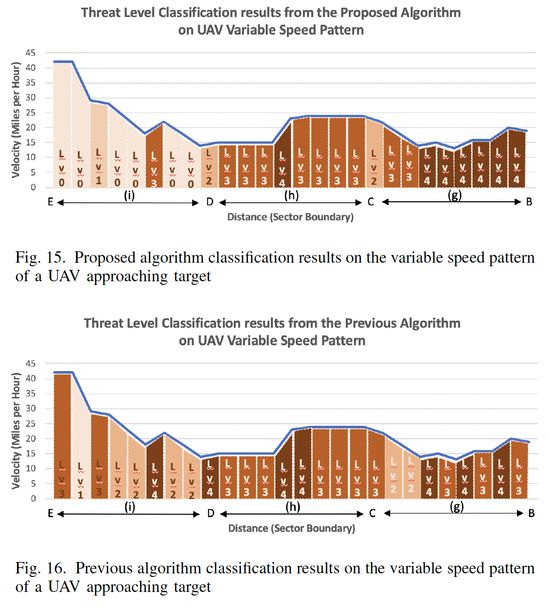

# Drone Threat Assessment

This is a drone threat level assessment research project that assesses an incoming drone's threat level based on it's speed and distance from target facility. 

<!-- TABLE OF CONTENTS -->
## Table of Contents

* [About the Project](#about-the-project)
  * [Inspiration](#inspiration)
  * [Motivation](#motivation)
  * [Goal](#goal)
  * [Outcome](#outcome)
* [Project Details](#project-details)
  * [Technologies Used](#technologies-used)
  * [Paper Link](#paper-link)
  * [Project Images](#project-images)

<!-- ABOUT THE PROJECT -->
## About The Project

### Inspiration
This research was inspired from my previous research project on red-light running vehicles where I modified an [off-the-shelf doppler radar sensor product](https://www.bushnell.com/additional-products/speed-guns/velocity-speed-gun/BU-101911.html) to provide low-cost but stable performance in order to substitute the high-cost conventional doppler radar sensor used in SOTA Counter-UAV Systems. The original purpose of the speed gun product used was in detecting the speed of vehicles. However, another of its usecase on baseballs inspired us to explore the application of this modified sensor to drones.

### Motivation
With the growing interest in drones complemented by drones' high functionality as well as easy accessbility, drones are now applied to a variey of fields from delivery services to military surveillance. As much as it holds potential in various positive applications, drone-associated threats on sensitive facilities and public safety with its increased involvement in illegal activities and terrorist attacks have triggered active research in Counter-UAV (CUAV) systems. Even with the active research and current technology, there has been significant drone-associated incidients such as:

* [Saudi Arabian Oil Facility Drone Attack](https://www.timesofisrael.com/saudi-arabian-oil-facility-struck-in-drone-attack/)
* [Drone used in attack on US electrical grid](https://www.newscientist.com/article/2296480-drone-used-in-attack-on-us-electrical-grid-last-year-report-reveals/#ixzz7FAKw5M5Uhttps://www.newscientist.com/article/2296480-drone-used-in-attack-on-us-electrical-grid-last-year-report-reveals/)

This provided the motivation to investigate a method to differentiate harmless drones (photography/hobby) from malicious drones, as well as the use of a low-cost sensor for drone detection, to reduce the overall cost of Counter-UAV systems for mass production and installation of these systems in public areas or facilities that can be targeted such as football stadiums.

### Goal

The main goal of this research was to investigate and provide a proof of concept of applying the modified sensor to Counter-UAV systems for drone threat analysis.

### Outcome
* Developed a proof of concept for applying the modified sensor to the detection & threat level assessment of drones.
* In substituting the conventional doppler radar with the modified sensor, the sensor cost was able to be reduced from $30K to $150.
* Presented and published a [paper](https://ieeexplore.ieee.org/document/9287915) in the 2020 4th IEEE International Conference on Robotic Computing (IRC).

incldue images & 

<!-- TABLE OF CONTENTS -->
## Project Details

### Technologies Used
* [Arduino Leonardo]()
* [Doppler Radar](https://www.bushnell.com/additional-products/speed-guns/velocity-speed-gun/BU-101911.html)
* [MongoDB]()
* [Express]()
* [Node.js]()

### Paper Link
* [UAV Threat Level Assessment based on the Velocity and Distance from Collision](https://ieeexplore.ieee.org/document/9287915)
   *  2020 4th IEEE International Conference on Robotic Computing (IRC)

### Project Images
* Doppler Radar Sensor Modified from Off-the-shelf Radar Gun

* Defined Sectors and Algorithm

* Threat Level Assessment

